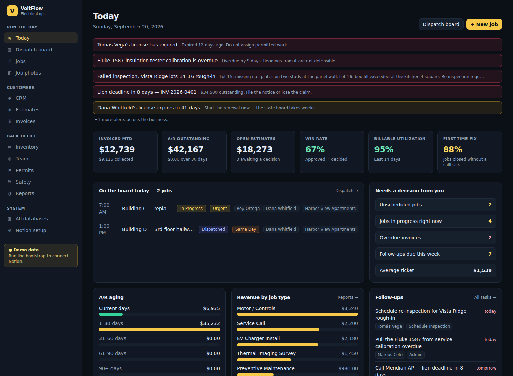

# VoltFlow

Field service management and CRM for an electrical contractor, with **Notion as the database**.

Everything an electrical service company touches in a day is here: the phone call, the
dispatch board, the truck, the panel photo, the permit, the quote, the invoice and the
collection call. No proprietary datastore — every record is a Notion page your team can
open, filter, comment on and export.



## Why Notion for the database

A three-truck shop already lives in Notion, and a field service platform that locks its
data away is a platform you eventually have to escape. Here the schema is provisioned
into your own workspace: the office can build a view, a bookkeeper can be given access to
Invoices alone, and nothing about the app is required to read your own records.

The trade-off is deliberate. Notion is not a transactional database — there is no
join engine and rate limits are real — so this app does the aggregation, keeps
derived figures (totals, margins, balances) written back as plain numbers, and treats
Notion as the durable, human-readable system of record.

## What it covers

| Area | What it does |
| --- | --- |
| **CRM** | Customers, contacts, service locations and a full interaction timeline — calls, texts, site walks, reviews, complaints |
| **Dispatch** | Five-day board by crew, pro-rated hours per day, unscheduled backlog, capacity warnings |
| **Jobs** | Work orders from the first call to close-out: problem in the customer's words, diagnosis, work performed, recommendations |
| **Job photos** | Before / during / after documentation uploaded straight into Notion storage, tagged by stage, location and job |
| **Estimating** | Good / Better / Best quotes with costed line items, so margin is visible before you send it |
| **Invoicing** | Progress billing, retainage, payments, A/R aging, DSO, and lien-deadline warnings |
| **Workforce** | Licenses, certifications and expiry alerts, burdened hourly cost, time entries split into labor / travel / warranty |
| **Inventory** | Priced catalog, truck and shop stock, reorder points, material usage per job, purchase orders, vendors |
| **Compliance** | Permits and inspections with corrections tracking, JHAs, LOTO records, energized work permits, incidents |
| **Assets** | Trucks, lifts and test equipment with calibration and registration dates |
| **Reporting** | Revenue and margin by job type, technician scorecard, lifetime value by lead source, callback rate, agreement renewals |

Every one of the 22 databases is also a generated CRUD UI and a validated REST endpoint,
so the parts without a bespoke screen are still fully usable.

## Quick start

```bash
npm install
npm run dev          # http://localhost:3000
```

With no credentials the app boots on a full demo company — ten customers, eighteen jobs,
photos, invoices, permits and safety records — so you can click through the whole thing
before connecting anything.

## Connecting Notion

1. **Create an internal integration** at <https://www.notion.so/my-integrations>.
   Give it read, update and insert content capabilities, and copy the secret.
2. **Create one empty page** in your workspace (call it *VoltFlow*) and share it with the
   integration: page menu → Connections → your integration. That single share is the
   only permission you grant; every database is created inside that page.
3. **Configure and provision:**

```bash
cp .env.example .env.local
#   NOTION_TOKEN=secret_...
#   NOTION_PARENT_PAGE_ID=<paste the page URL or its id>

npm run notion:bootstrap     # creates all 22 databases and wires the relations
npm run notion:seed          # optional: load the sample company
npm run notion:verify        # confirms Notion matches the schema
```

The bootstrap writes `.notion-ids.json` (gitignored) and prints `NOTION_DB_*` lines for
deployments that need the ids in the environment instead. Re-running it is safe: existing
databases are matched by title and patched with any properties the schema has gained.

Visit `/setup` in the app for live connection status and the full database mapping.

## How it is built

```
src/lib/schema/         One declarative description of all 22 databases
src/lib/notion/         REST client, property mapper, file uploads, id registry
src/lib/store/          Store interface — Notion-backed, plus an in-memory demo store
src/lib/domain.ts       Business rules on write: numbering, totals, margin recalculation
src/app/                Next.js App Router — bespoke screens plus a generated record browser
scripts/                bootstrap / verify / seed
```

The schema is the spine. `src/lib/schema/databases.ts` declares every database, field,
type, select option and relation, and that single file drives:

- **provisioning** — `scripts/bootstrap-notion.ts` turns it into Notion property schemas
- **reading and writing** — `src/lib/notion/mapper.ts` encodes and decodes page properties
- **validation** — `src/lib/schema/validate.ts` builds a Zod schema per database
- **the UI** — table columns, detail views and forms are generated from the same field list

Add a field there and it appears in Notion, in the API and in the forms. There is no
second place to update.

See [`docs/ARCHITECTURE.md`](docs/ARCHITECTURE.md) for the data model and the reasoning
behind the Notion-specific decisions, and [`docs/OPERATIONS.md`](docs/OPERATIONS.md) for
how a day actually runs through the system.

## API

```
GET    /api/records/:db?search=&limit=&<field>=<value>
POST   /api/records/:db
GET    /api/records/:db/:id
PATCH  /api/records/:db/:id
DELETE /api/records/:db/:id        # archives the Notion page
POST   /api/photos                 # multipart upload → Notion file storage
```

Writes are validated against the schema before they reach Notion, so a bad select value
is a 422 rather than a silently created option.

## Scripts

| Command | Purpose |
| --- | --- |
| `npm run dev` | Development server |
| `npm run build` / `npm start` | Production build and serve |
| `npm run typecheck` | TypeScript, no emit |
| `npm run notion:bootstrap` | Create or update the Notion databases |
| `npm run notion:verify` | Diff the live workspace against the schema (exits non-zero on drift) |
| `npm run notion:seed` | Load the sample company (`-- --dry` to preview) |

## Known limits

- **Status properties** cannot be created through the Notion API, so every workflow state
  is a `select`. Convert one in the Notion UI afterwards if you want board grouping.
- **Photo uploads** use Notion's single-part endpoint: 20 MB per file. Notion's file URLs
  are signed and expire, so the app re-reads them rather than caching.
- **No authentication layer.** Deploy it behind your identity provider or a reverse proxy;
  the Notion token is server-side only, but the app itself assumes trusted users.
- **Rate limits.** Notion allows roughly three requests per second. List pages read whole
  tables and memoize per request, which suits a shop with hundreds of jobs; tens of
  thousands would want a cache in front.
