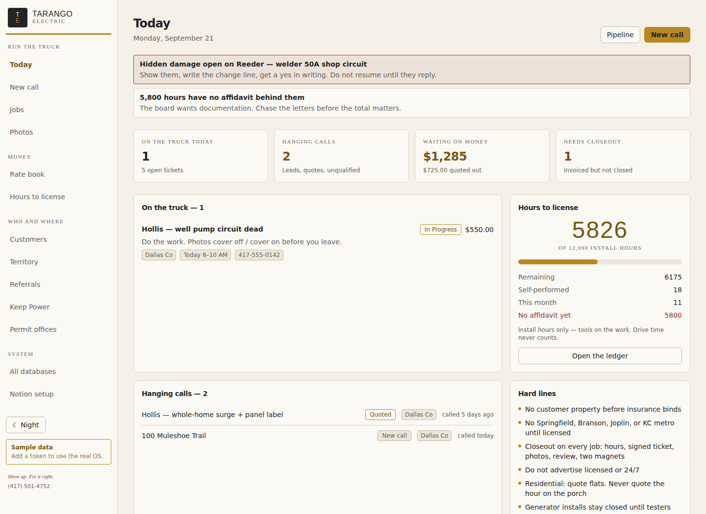

# Tarango Electric — field desk

A field-service app for **Tarango Electric**, Corey Tarango's one-truck electrical service
company in Bolivar, Missouri. It runs on the **Tarango Electric OS** in Notion — the same
databases already in the workspace, not a copy.

> Show up. Fix it right.



## What it is for

The OS page says it plainly: *"Run the work in the field app — New call, advance the ticket,
closeout. Notion stays the source of truth."* That is exactly what this is. Notion keeps being
the file cabinet; this is the thing you actually hold while the phone is ringing or while you
are standing at a panel with the cover off.

Three rules of the business are enforced by the software rather than by memory:

| Gate | What it does |
| --- | --- |
| **Town gate** | Every call is checked against Service Territory before anything else. Green books a diagnostic, amber opens at Qualify with "call the AHJ", red and *unrecognised* both refuse to quote. An unknown town fails closed, not open. |
| **Closeout gate** | A job cannot reach Closed until hours, photos, signature, payment or Net 15, review ask and magnets are all done. The server enforces it, so it cannot be clicked past. |
| **Copy guard** | Customer-facing text is checked against the brand kit's do-not-print list — "licensed", "24/7", "emergencies", Springfield as a service area. |

## The screens

| Screen | What it does |
| --- | --- |
| **Today** | What is on the truck, what is hanging, what closeout is owed, and hours to license |
| **New call** | Town first, then who and what. The only action offered is the one the gate allows |
| **Jobs** | The pipeline board by status, or a table. Red towns show no price |
| **Job ticket** | Play button, closeout checklist, photos by stage, the call, money, hours |
| **Photos** | Every before / panel / after, and which jobs are still short |
| **Rate book** | The 41 published rows with their `Assumes` scope, plus a quote builder |
| **Hours to license** | Install hours toward 12,000, by source, with affidavit gaps called out |
| **Customers, Territory, Referrals, Keep Power, Permit offices** | The reference tables, worked rather than browsed |

Every database also has a generated CRUD screen at `/records/<db>` and a validated REST
endpoint, so nothing is unreachable.

## The money rules, in one place

From the *Rate card rules* page, encoded in `src/lib/domain/rules.ts`:

- Residential diagnostic **$119**, credited if repaired the same visit. Commercial **$149**
  first hour, then **$125/hr**.
- Travel Zone A (Bolivar, Buffalo, Marshfield city) included, **B $45**, **C $85**.
- Materials **cost + 35%**. Deposit **50% over $1,500**. Old work **+25%**.
  After hours **1.5×**. Holiday **2×**, only if you answer.
- Residential pays at completion. New commercial is due on completion, then Net 15.
- Generator *installs* stay closed until load-bank testers are on the truck. Service and
  annual inspections are open.

Change a number there and it changes in the quote builder, the ticket and the rate card at once.

## Running it

```bash
npm install
npm run dev          # http://localhost:3000
```

On a phone or iPad, see [`docs/INSTALL.md`](docs/INSTALL.md) — it is installable
to the home screen as a full-screen app with the TE mark.

With no credentials it boots on sample data shaped like the real OS — the actual Rate Book and
Service Territory rows, so the gates and the quote math behave correctly before Notion is wired
up. See [`docs/NOTION.md`](docs/NOTION.md) to connect the live workspace; the database ids are
already in `notion.config.json`, so a token is the only secret to supply.

## Brand

The kit is a four-colour lock. Nothing outside it appears in the UI.

| | Hex | Role |
| --- | --- | --- |
| Charcoal | `#222426` | Type on paper, surfaces at night |
| Aged White | `#F5F1E8` | Paper — the default background |
| Harvest Gold | `#B8871F` | Rules, fills and small caps. **Never body text** — it is 2.9:1 on paper |
| Oxide Red | `#8E382F` | Tagline and hazard only. Never decoration |

Two themes, both inside the lock: **Day** (paper, the default, because most calls happen in
Missouri daylight) and **Night** (the charcoal truck field, for attics and after-dark calls).
Estimates render on paper in either theme, with the wordmark and tagline and no barn badge —
the kit says no barn on legal pages. Every text/background pair is checked against WCAG AA;
see [`docs/BRAND.md`](docs/BRAND.md) for the ratios and the full do-not-print list.

## Architecture

```
src/lib/schema/     the 9 Notion databases, with their exact property names
src/lib/domain/     rules, gates, playbook, quote math — the business, in one place
src/lib/notion/     REST client, property mapper, file uploads, id registry
src/lib/store/      Store interface: Notion-backed, plus in-memory sample data
src/app/            the screens
scripts/            bootstrap / verify / seed
```

`src/lib/schema/databases.ts` declares every database and field once, and that declaration
drives provisioning, reading and writing, validation, the generated forms and the table
columns. See [`docs/ARCHITECTURE.md`](docs/ARCHITECTURE.md).

## Known limits

- **One shared passcode**, set with `APP_PASSCODE`, is the whole auth story — right for one
  person, not for a crew with separate logins. Unset, the app is open; the setup screen says so
  in red.
- **No offline mode.** Server-rendered, so no signal means no app. Photos can be taken in the
  camera app and attached later.
- **Notion formulas are opaque to the API.** `Play`, `Lane`, `Ready` and `Closeout score` can
  be read but their source cannot. The app restates that logic from the OS pages that define
  it and shows Notion's `Play` alongside its own, so the two can be compared.
- **Photos cap at 20 MB** each — Notion's single-part upload limit.
- One thing in the kit contradicts itself: the Do/Don't table says not to set the phone number
  in Harvest Gold, but `magnet.svg` does exactly that. The app follows the written rule.
